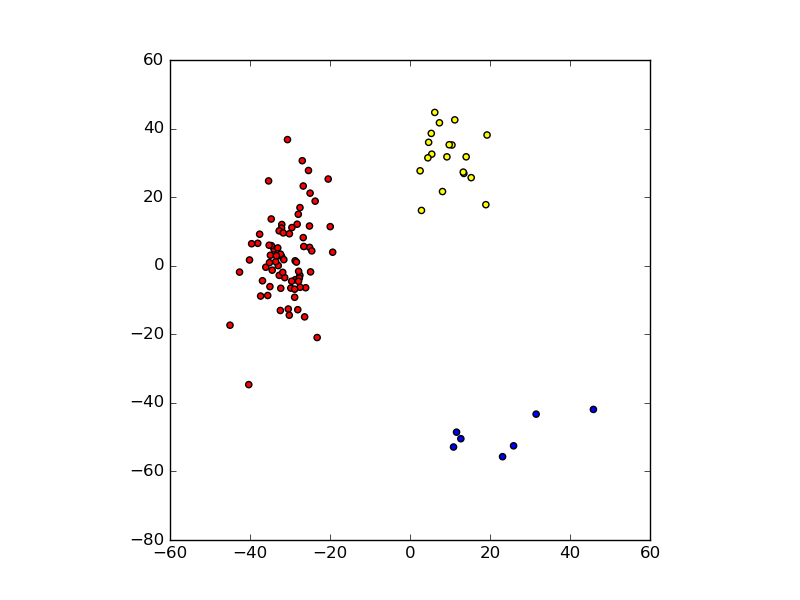
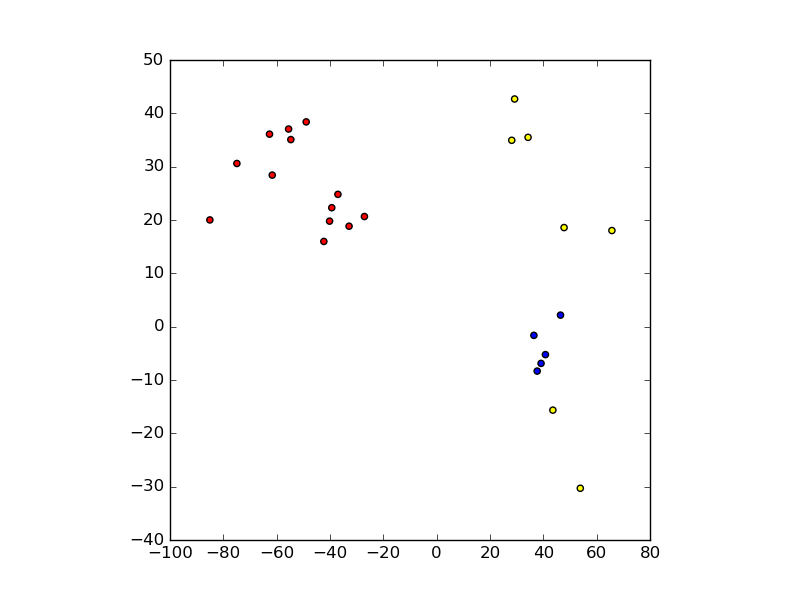
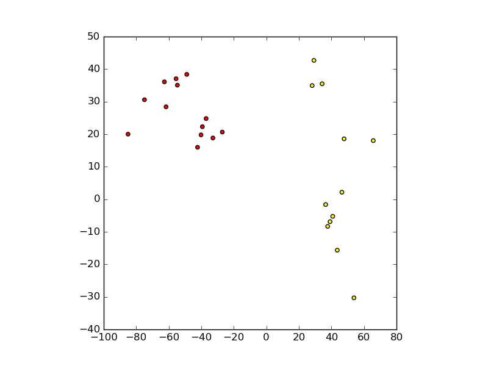
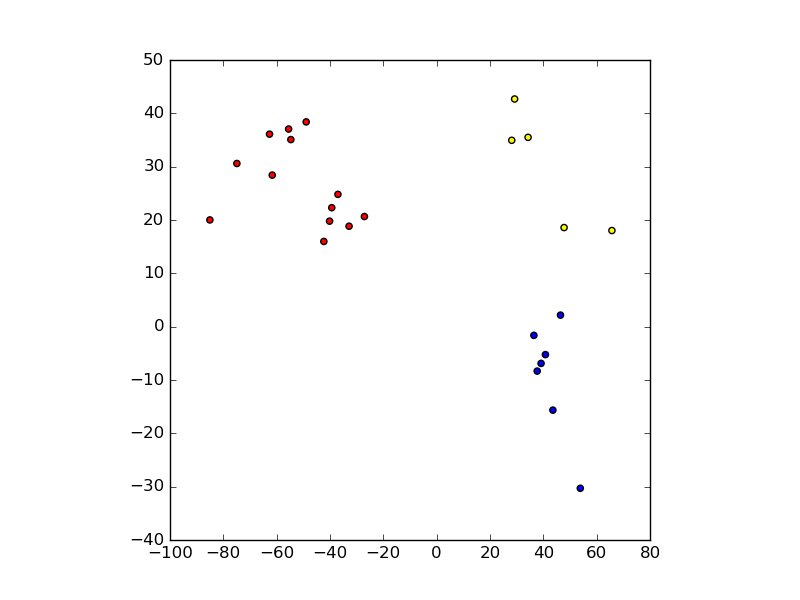

# Deep Learning Assingment

## Problem decription

The objective is to classify unknown 2D points by color
given a cloud of previously known points. The problem is
examined using the Deep Learing framework `theanets` with
the Python programming language.

## Data generation

The training and test data is generated by playing
with the global variables in the `gen_data.py` script.
The script can generate point clouds of three given
colors using `numpy`'s normal sampling functions. An
example of such a distribution can be seen in the following figure.



An example training dataset is included with this report
in the file `data.csv`. It consists of a 100 point cloud
and corresponds to the data plotted in the previous figure.
The annex file `test_data.csv` correspond to a 25 points
cloud and was used to test the different deep learning networks.

## Architectures tested

The problem was examined with three different networks, each
having one, two and three hidden layers and one output layer
respectively. The configuration of each network is given in each
of the following sections. All networks were tested with the dataset
seen in the following figure.



The test were designed and implemented in the `deep.py` script
included with this report. The script can be executed as follows:

```
  python deep.py [TRAINING DATA] [TEST DATA]
```

The optional arguments `TRAINING DATA` and `TEST DATA` can be
the file names of two CSV files generated with the `gen_data.py`
script. If the arguments are missing then `deep.py` will use the
names `data.csv` and `test_data.csv` as it's input files respectively.

### Network [2, 4, 3]

This is the simplest network. As can be seen in the following figure,
this network cannot distinguish between the three classes correctly,
classifying all blue points from the test data set as yellow points.



### Network [2, 8, 4, 3]

This more complex network is now able to correctly classify the blue
points from the test dataset as blue, however, the two yellow dots on
the lower right of the following figure are incorrectly classified as
blue.



### Network [2, 8, 6, 4, 3]

For this particular test, the three hidden layers network produced the
same result as the two hidden layers network. The results of this test
can be seen in the following figure.


# Possible improvements

One way of improving results for these tests would be including
more data points of the blue class, so that the classifiers are
not so biased towards the red and yellow classes. This could be
achieved by either modifying the `gen_data.py` script with more
complex data generation techniques in order to produce more balanced
datasets. Another possibility would be implementing a class balancing
algorithm to generate more data points before passing the data
to the networks for training.

# Summary

The following table shows a summation of the results achieved
for each deep learning network architecture. These results are printed
to screen by the `deep.py` script alongside a confusion matrix for the
corresponding test.

 *Network*     | *Accuracy* | *TP rate* | *FP rate* | *TN rate* | *FN rate* 
---------------|------------|-----------|-----------|-----------|-----------
 2, 4, 3       |        0.8 |       0.8 |       0.1 |       0.9 |       0.2 
 2, 8, 4, 3    |       0.92 |      0.92 |      0.04 |      0.96 |      0.08 
 2, 8, 6, 4, 3 |       0.92 |      0.92 |      0.04 |      0.96 |      0.08 
